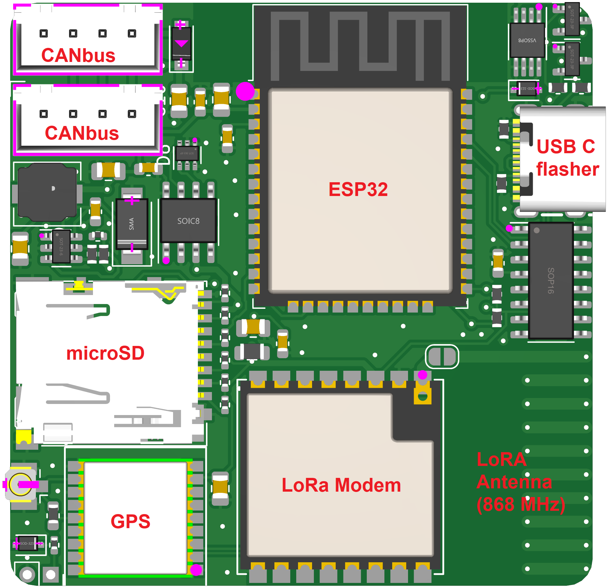

# Bobby Car Telemetry PCB

This board should be mounted on the Bobby Car.

There are 2 CAN bus connectors, pin-compatible with the boardcomputer PCB, and can either be wired:
- after the boardcomputer or
- in-line between the motorcontrollers and the boardcomputer

It has following hardware:
- SN65HVD230 CAN transceiver
- 15V to 3.3V DC-DC converter (board can also be powered by 5V USB)
- ESP32-WROOM-32E (8MB)
- CH343G USB to UART converter for programming
- ATGM336H-5N31 GNSS
  - supports GPS (US), GLONASS (Russia), Galileo (EU), BeiDou (China), QZSS (Japan)
  - u.FL connector for active antenna 
  - protocol compatible with NEO-6M
  - optional 3V recharge battery connector for faster cold start
- self bomb microSD card slot
- LM75B temperature sensor
- RA-01SH 868MHz LoRa module with two antenna options:
  - integrated u.FL connector for external helical antenna
  - solder jumper to enable the onboard PCB helical antenna

